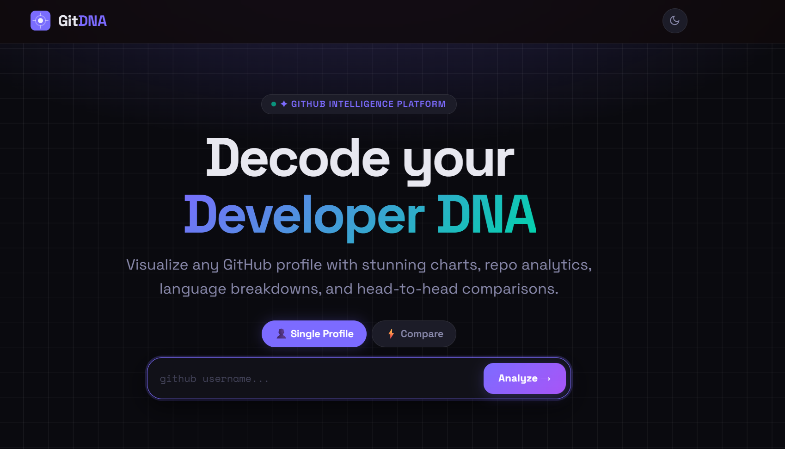
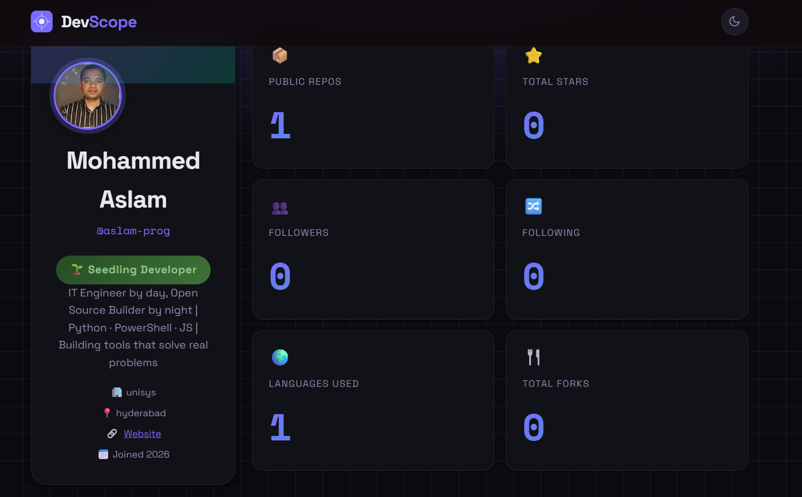
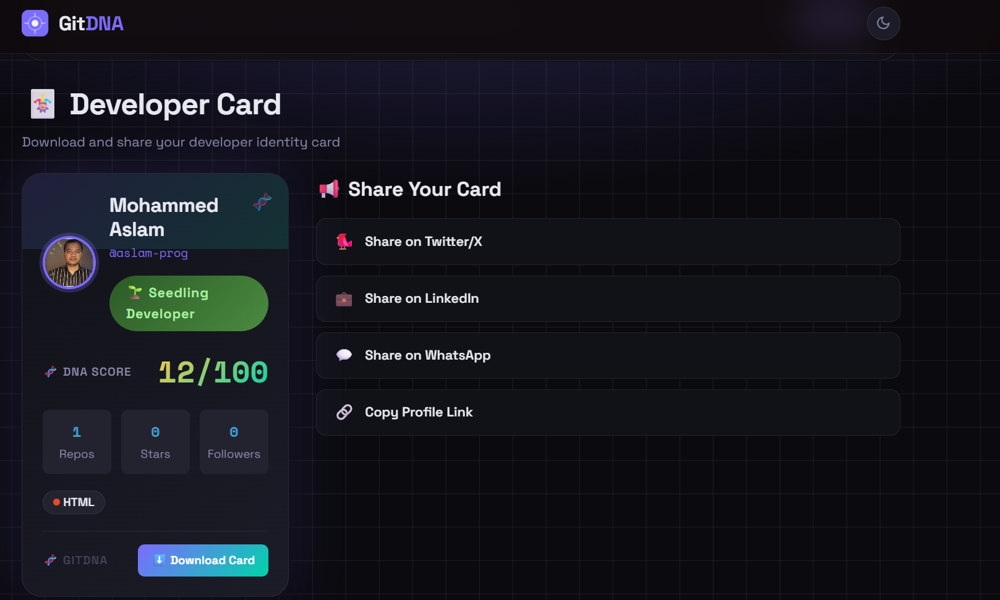
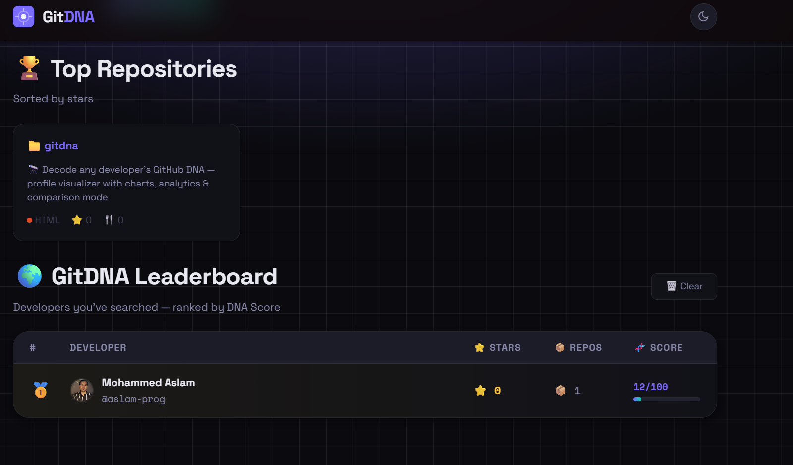

# 🧬 GitDNA — GitHub Profile Visualizer

<p align="center">
  
  
  
  
</p>

> **Decode any developer's DNA** — stunning visual analytics for any GitHub profile.

---

## ✨ Features

| Feature | Description |
|---|---|
| 🧬 **Developer DNA Score** | Unique algorithmic score based on activity, influence, diversity & collaboration |
| 🎖️ **Rank & Badge System** | Auto-assigned rank from 🌱 Seedling to 🏆 Legend based on DNA Score |
| 🃏 **Developer Card** | Downloadable identity card — share on Twitter, LinkedIn & WhatsApp |
| 🌍 **Global Leaderboard** | All searched developers ranked live by DNA Score |
| 🔗 **Shareable Profile URL** | One-click link to share any developer's GitDNA report |
| 📊 **Language Breakdown** | Beautiful doughnut chart of all programming languages used |
| 📈 **Repo Activity** | Bar chart of repositories created per year |
| ⭐ **Stars Distribution** | Horizontal bar chart of most-starred repos |
| 🏆 **Top Repositories** | Cards for top repos with stars, forks, and language |
| ⚡ **Head-to-Head Compare** | Battle mode — compare any two GitHub users side by side |
| 🌙 **Dark / Light Mode** | Sleek dark mode by default, toggle anytime |
| 📱 **Fully Responsive** | Works beautifully on desktop and mobile |

---

## 🚀 Live Demo

🌐 **[https://aslam-prog.github.io/gitdna/gitdna.html](https://aslam-prog.github.io/gitdna/gitdna.html)**

> Open in any browser — **no server needed!**

---

## 📸 Screenshots

### 🏠 Homepage


### 🧬 DNA Score & Rank Badge


### 🃏 Developer Card


### 🌍 Leaderboard


---

## 🛠️ Tech Stack

- **Vanilla HTML/CSS/JavaScript** — zero dependencies, zero build tools
- **GitHub REST API** — public, no authentication required
- **Chart.js** — beautiful, animated charts via CDN
- **html2canvas** — developer card PNG download
- **Google Fonts** — Space Grotesk + Space Mono

---

## 📦 Getting Started

```bash
# Clone the repo
git clone https://github.com/aslam-prog/gitdna.git
cd gitdna

# Just open the file!
open gitdna.html
```

That's it. No `npm install`. No backend. No API keys.

---

## 🧬 How the DNA Score Works

The Developer DNA Score (0–100) is calculated from 6 weighted signals:

| Signal | Description |
|---|---|
| **Repo Activity** | How many public repos relative to a benchmark |
| **Influence** | Total stars earned across all repositories |
| **Collaboration** | Follower count relative to benchmark |
| **Language Diversity** | Number of unique programming languages used |
| **Community Ratio** | Following/Followers social engagement ratio |
| **Open Source Score** | Forks, bio completeness, and openness indicators |

---

## 🎖️ Rank System

| Score | Rank |
|---|---|
| 0–20 | 🌱 Seedling Developer |
| 21–40 | 🔧 Code Apprentice |
| 41–60 | ⚡ Active Builder |
| 61–75 | 🚀 GitHub Warrior |
| 76–90 | 💎 Open Source Hero |
| 91–100 | 🏆 Legend Developer |

---

## 🔗 Share a Profile

Share any developer's report directly using the URL format:

```
https://aslam-prog.github.io/gitdna/gitdna.html?user=USERNAME
```

Example:
```
https://aslam-prog.github.io/gitdna/gitdna.html?user=torvalds
```

---

## 🤝 Contributing

Pull requests are welcome! Feel free to open issues for:
- New chart types
- Additional DNA metrics
- UI improvements
- Feature requests

1. Fork the repo
2. Create your feature branch (`git checkout -b feature/AmazingFeature`)
3. Commit your changes (`git commit -m 'Add AmazingFeature'`)
4. Push to the branch (`git push origin feature/AmazingFeature`)
5. Open a Pull Request

---

## 📄 License

MIT © [Mohammed Aslam](https://github.com/aslam-prog)

---

<p align="center">Built with ❤️ by <a href="https://github.com/aslam-prog">Mohammed Aslam</a> · <a href="mailto:uniqueehubs@gmail.com">uniqueehubs@gmail.com</a></p>
